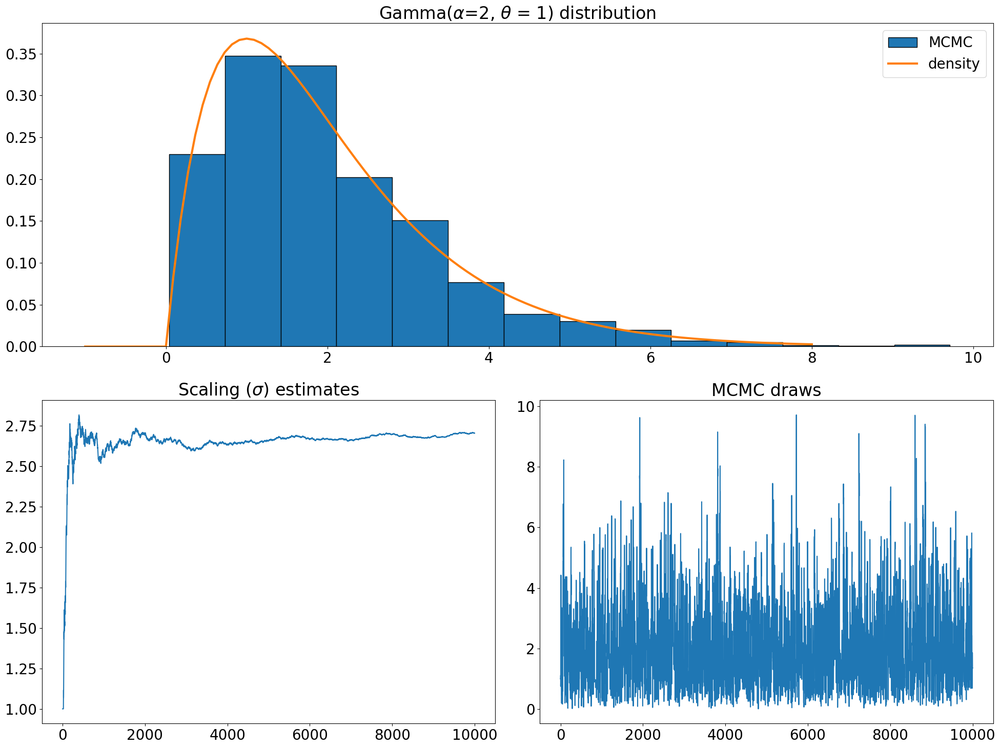

# Adaptive optimal scaling of MCMC

## A lightweight Python implementation of Adaptive optimal scaling of Metropolis–Hastings algorithms using the Robbins–Monro process: [Grathwaite et al., 2016](https://www.tandfonline.com/doi/full/10.1080/03610926.2014.936562).

The overall acceptance rate of the random walk Metropolis-Hasting algorithm is crucial for its efficiency. The acceptance rate depends highly on the scaling factor (variance) of its proposal distribution (usually Gaussian). This paper uses the Robbins-Munro search process to adaptively find the scaling factor of the random walk Metropolis-Hastings algorithm. Based on theoretical findings for certain distributions, the goal is to reach the optimal acceptance rate of 0.44 for univariate distributions and 0.234 for multivariate distributions. See paper for more details.

Heavily inspired from the R code from the authors: https://web.maths.unsw.edu.au/~yanan/RM.html.

## Examples

See examples.py for univiariate and multivariate examples.

